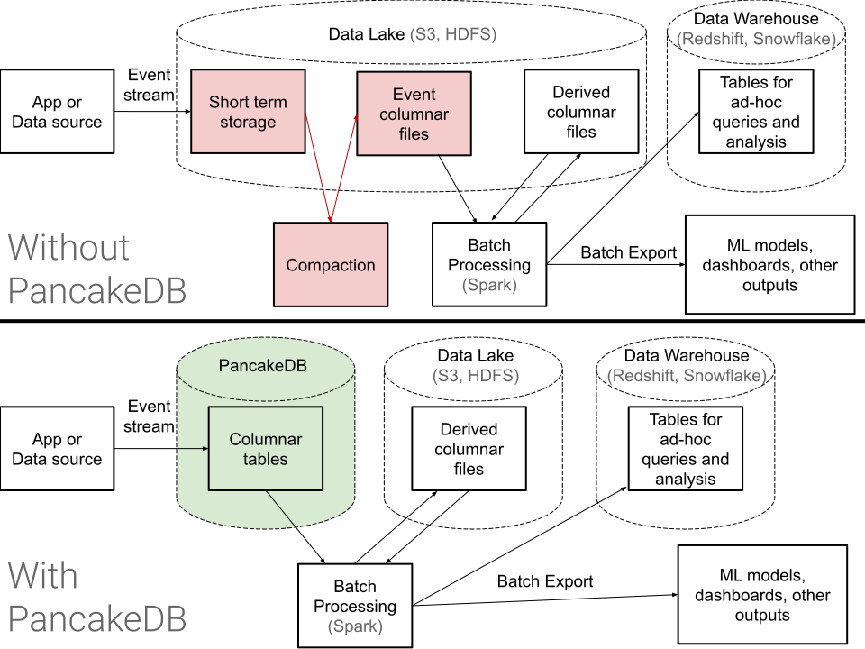

[![Crates.io][crates-badge]][crates-url]
[![Maven Central][maven-badge]][maven-url]

[crates-badge]: https://img.shields.io/crates/v/pancake-db-idl.svg
[crates-url]: https://crates.io/crates/pancake-db-idl
[maven-badge]: https://maven-badges.herokuapp.com/maven-central/com.pancakedb/idl/badge.svg?gav=true
[maven-url]: https://search.maven.org/artifact/com.pancakedb/idl


# Using the PancakeDB API

A typical PancakeDB use case involves
* human-driven management of PancakeDB tables with `create_table`
* writing incoming events or processed data as streams
(up to 256 rows at a time) to PancakeDB with `write_to_partition`.
* reading millions (or more) rows at a time, often in a distributed manner,
from PancakeDB for batch processing (e.g. Spark or Hive),
training machine learning models, or exporting to data warehouses. This
involves calling
`list_segments` and then `read_segment_column` for each listed segment and
desired column.

Importantly, PancakeDB expects to receive **many small writes per second**
that it will respond to with reliably fast response times, and it
expects to receive a **few giant reads per second** that it will respond to
with high throughput.



# HTTP+JSON API specification

PancakeDB's API is defined by the [.proto files in this repository](./protos).
For now, only HTTP+JSON is supported for communication with the server,
but HTTP2+protobuf support may be coming soon.

Example curl:

```
curl \
  -XGET \
  -H "Content-Type: application/json" \
  $IP:$PORT/rest/list_segments \
  -d '{"table_name": "'$TABLE_NAME'"}'
```

## List Tables

`GET /rest/list_tables`

request body format:
```
{}
```

response body format:
```
{
  "tables": [
    {"table_name": "..."},
    ...
  ]
}
```

This lists all tables.

## Create Table

`POST /rest/create_table`

request body format:
```
{
  "table_name": "...",
  "schema": {
    "partitioning": {
      "...": {
        "dtype": "STRING" | "INT64" | "BOOL" | "TIMESTAMP_MINUTE"
      },
      ...
    },
    "columns": {
      "...": {
        "dtype": "STRING" | "INT64" | "BOOL" | "BYTES" | "FLOAT32" | "FLOAT64" | "TIMESTAMP_MICROS",
        "nested_list_depth": int
      },
      ...
    }
  },
  "schema_mode": "FAIL_IF_EXISTS" | "OK_IF_EXACT" | "ADD_NEW_COLUMNS"
}
```

response body format:
```
{
  "already_exists": bool,
  "columns_added": ["...", ...]
}
```

The keys in the partitioning and columns objects are column names.

This will ensure a table exists following the behavior requested by
`schema_mode`:
* `FAIL_IF_EXISTS` works like most other databases' create table commands,
returning an error if the table already exists.
* `OK_IF_EXACT` will not give an error if the table already exists, as long as
its schema is identical.
* `ADD_NEW_COLUMNS` will not give an error if the table already exists, as long
as the existing columns are a subset of the requested ones. Any new columns in
the request will be added to the table.
This is a declarative way to create a table.

In a successful response, `already_exists` indicates whether the table already
existed prior to the request, and `columns_added` is a list of the column names
that were added by the request.

Your schema is important.
Partitioning is the only way to allow filtering your data.
For example, you may wish to partition by a timestamp truncated to the last hour
so that your users can quickly select all rows
falling into a time range.
You may partition by multiple fields, but keep in mind that each partition
should ultimately be large (>100k rows) to be efficient.

Previous data architectures typically required partitioning by a timestamp
at hourly or daily granularity to fit with the compaction schedule and make
sure each partition has a moderate amount of data.
With PancakeDB, table design is liberated from those restrictions, and the
developer can choose partitioning to match their filter query pattern instead.

There is a limit of 255 columns per table.
If you find yourself needing more than that, it's probably
time to rethink your data model.

## Alter Table

request body format:
```
{
  "table_name": "...",
  "new_columns": {
    "...": {
      "dtype": "STRING" | "INT64" | "BOOL" | "BYTES" | "FLOAT32" | "FLOAT64" | "TIMESTAMP_MICROS",
      "nested_list_depth": int
    },
    ...
  }
}
```

response body format:
```
{}
```

This will modify the schema by adding new columns.
It will fail if any of the columns already exist.

## Drop Table

`POST /rest/drop_table`

request body format:
```
{
  "table_name": "..."
}
```

response body format:
```
{}
```

Caution - dropping a table is not reversible.
It actually deletes your data on disk.

At the moment, alter table or adding columns have not yet been implemented,
so schema changes need to be done by creating a new table,
copying the data over, and dropping the old one.

## Get Schema

`GET /rest/get_schema`

request body format:
```
{
  "table_name": "..."
}
```

request response format:
```
{
  "schema": {
    "partitioning": {
      "...": {
        "dtype": "STRING" | "INT64" | "BOOL" | "TIMESTAMP_MINUTE"
      },
      ...
    },
    "columns": {
      "...": {
        "dtype": "STRING" | "INT64" | "BOOL" | "BYTES" | "FLOAT32" | "FLOAT64" | "TIMESTAMP_MICROS",
        "nested_list_depth": int
      },
      ...
    }
  },
}
```

## Write to Partition

`POST /rest/write_to_partition`

request body format:
```
{
  "table_name": "...",
  "partition": {
    "...": {
      "string_val": "..." | "int64_val": int | "bool_val": bool | "timestamp_val": "1970-01-01T00:00:00.000Z"
    },
    ...
  },
  "rows": [
    {
      "fields": {
        "...": {
          "value": {
            "list_val": {"vals": [...]} | "string_val": "..." | "int64_val": int | "bool_val": bool | "bytes_val": [...] | "float64_val": float | "timestamp_val": "1970-01-01T00:00:00.000Z"
          }
        },
        ...
      }
    },
    ...
  ]
}
```

response body format:
```
{}
```

Each write to partition request may contain up to 256 rows.
If you need to write to multiple partitions at once, you must send multiple
requests.

For most use cases, `write_to_partition_simple` is recommended instead due to
its simpler JSON request.

## Write to Partition, Simplified

`POST /rest/write_to_partition_simple`

request body format:
```
{
  "table_name": "...",
  "partition": {
    "...": <value>,
    ...
  },
  "rows": [
    {
      "...": <value>,
    },
    ...
  ]
}
```

response body format:
```
{}
```

With this route, natural JSON encoding is used.
For example, a valid row would be
```
{
  "my_int_col": 33,
  "my_nested_string_col": ["foo", "bar"]
}
```

## List Segments

`GET /rest/list_segments`

request body format:
```
{
  "table_name": "...",
  "partition_filter": [
    {
      "value: {
        "comparison": {
          "name": "...",
          "operator": "EQ_TO" | "LESS" | "LESS_OR_EQ_TO" | "GREATER" | "GREATER_OR_EQ_TO",
          "value": {
            "string_val": "..." | "int64_val": int | "bool_val": bool | "timestamp_val": "1970-01-01T00:00:00.000Z"
          }
        }
      }
    }
  ],
  "include_metadata": bool
}
```

response body format:
```
{
  "segments": [
    {
      "partition": {
        "...": {
          "string_val": "..." | "int64_val": int | "bool_val": bool | "timestamp_val": "1970-01-01T00:00:00.000Z"
        },
        ...
      ],
      "segment_id": "...",
      (if include_metadata) "metadata": {
        "count": int,
        "latest_version": int
      }
    }
  ]
}
```

This lists all segments (chunks of data typically containing up to 1 million
rows) in the table, matching all the partition filters specified.
Additional metadata about each segment will only be returned if requested,
because retrieving the metadata is a bit slower.

Right now this returns all matching segments at once.
In the future, it will likely:
* use a continuation token in case there is a very large number of segments
* allow passing in parameters for distributed listing

## Read Segment Column

`GET /rest/read_segment_column`

request body format
```
{
  "table_name": "...",
  "partition": {
    "...": {
      "string_val": "..." | "int64_val": int | "bool_val": bool | "timestamp_val": "1970-01-01T00:00:00.000Z"
    },
    ...
  ],
  "segment_id": "...",
  "column_name": "...",
  "continuation_token: "..."
}
```

response body format
```
{
  "codec": "...",
  "row_count": int,
  "implicit_nulls_count: int,
  "continuation_token": "..."
}
<newline character>
<byte data>
```

If `codec` is included in the response, it means the byte data
following the JSON blob is compressed; otherwise it is uncompressed.
The data can be decoded with the
[PancakeDB core library](https://github.com/pancake-db/pancake-core/tree/main/core).

If a non-empty `continuation_token` is returned, you must make another request
with that continuation token (and so forth) until you have collected all the
compressed and uncompressed data for the segment column.

This API route is hard to use directly, so each client library
also implements some sort of "decode" functionality,
leveraging the core library, to obtain deserialized
rows.


