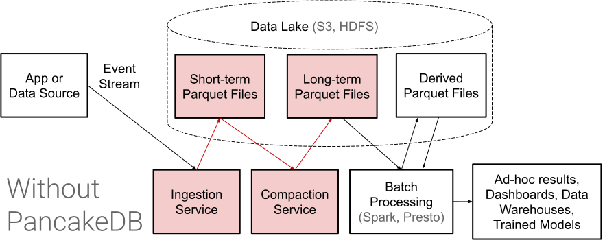
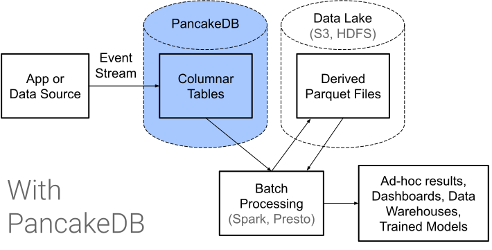

[![Crates.io][crates-badge]][crates-url]
[![Maven Central][maven-badge]][maven-url]

[crates-badge]: https://img.shields.io/crates/v/pancake-db-idl.svg
[crates-url]: https://crates.io/crates/pancake-db-idl
[maven-badge]: https://maven-badges.herokuapp.com/maven-central/com.pancakedb/pancake-db-idl/badge.svg?gav=true
[maven-url]: https://search.maven.org/artifact/com.pancakedb/pancake-db-idl

# Using the PancakeDB API

A typical PancakeDB use case involves
* human-driven management of PancakeDB tables with `create_table`
* writing incoming events or processed data as streams
(up to 256 rows at a time) to PancakeDB with `write_to_partition`.
* reading millions (or more) rows at a time, often in a distributed manner,
from PancakeDB for batch processing (e.g. Spark or Hive),
training machine learning models, or exporting to data warehouses. This
involves calling
`list_segments` and then `read_segment_column` for each listed segment and
desired column.

Importantly, PancakeDB expects to receive **many small writes per second**
that it will respond to with reliably fast response times, and it
expects to receive a **few giant reads per second** that it will respond to
with high throughput.

<div align="center">


</div>

# GRPC API specification

PancakeDB's main API protocol is GRPC.
See [service.proto](./protos/service.proto) for its service definition.
Below is a description of what each API call does.

## Alter Table

Modifies the configuration of an existing table, e.g. by adding columns.
Fails if any of the added columns already exist.

## Create Table

Creates a table.

The keys in the partitioning and columns objects are column names.

This will ensure a table exists following the behavior requested by
`mode`:
* `FAIL_IF_EXISTS` works like most other databases' create table commands,
  returning an error if the table already exists.
* `OK_IF_EXACT` will not give an error if the table already exists, as long as
  its schema is identical.
* `ADD_NEW_COLUMNS` will not give an error if the table already exists, as long
  as the existing columns are a subset of the requested ones. Any new columns in
  the request will be added to the table.
  This is a declarative way to create a table.

In a successful response, `already_exists` indicates whether the table already
existed prior to the request, and `columns_added` is a list of the column names
that were added by the request.

Your schema is important.
Partitioning is the only way to allow filtering your data.
For example, you may wish to partition by a timestamp truncated to the last hour
so that your users can quickly select all rows
falling into a time range.
You may partition by multiple fields, but keep in mind that each partition
should ultimately be large (>100k rows) to be efficient.

Previous data architectures typically required partitioning by a timestamp
at hourly or daily granularity to fit with the compaction schedule and make
sure each partition has a moderate amount of data.
With PancakeDB, table design is liberated from those restrictions, and the
developer can choose partitioning to match their filter query pattern instead.

There is a limit of 255 columns per table.
If you find yourself needing more than that, it's probably
time to rethink your data model.

## Delete from Segment

This deletes rows from a segment, using row id.
You can determine which row ids you want to delete
by scanning the built-in `_row_id` column when you read
a segment.

Deleted rows will not immediately be removed from disk.
They will persist until the segment is next compacted, which could be up to a
day.
It is necessary to call `read_segment_deletions` whenever reading a segment
in order to get an accurate view of the data.

## Drop Table

Deletes a table and all its data.

Caution - dropping a table is not reversible.
It actually deletes your data on disk.

## Get Schema

Returns the schema of an existing table.

## List Segments

This lists all segments (large groups of rows
rows) in the table, matching all the partition filters specified.
Additional metadata about each segment will only be returned if requested,
because retrieving the metadata is a bit slower.

## List Tables

Returns a list of all tables.

## Read Segment Column

The way to read columnar data from PancakeDB.
Returns data as a stream of encoded bytes, so you'll typically want to use a
client library to decode the data.

If `codec` is included in the response, it means the byte data
following the JSON blob is compressed; otherwise it is uncompressed.
The data can be decoded with the
[PancakeDB core library](https://github.com/pancake-db/pancake-core/tree/main/core).

Either a correlation ID (for the first request for the segment column) or a
continuation token (for each following request) is required.
You should use the same correlation ID you are using for the segment's deletions
(see below) and other columns.

## Read Segment Deletions

Returns compressed data for a list of booleans representing
whether each row is deleted.
You must use the same correlation ID you are using for reading
the segment's columns.

This route is also hard to use directly, so it is better to use
a client library's "decode" functionality.

If you read a segment's columns without its deletions, you
will have an incorrect view of the data if any recent deletions
have happened.
The deletion data is very lightweight, so this step should not be skipped.

## Write to Partition

Write rows to a partition of a PancakeDB table.

This is the main way to get data into PancakeDB.
Each write to partition request may contain up to 256 rows.
If you need to write to multiple partitions at once, you must send multiple
requests.

# REST API specification

PancakeDB also supports certain routes via HTTP+JSON for ease of use and
demonstration purposes.

Example curl:

```
curl \
  -XGET \
  -H "Content-Type: application/json" \
  $IP:$PORT/rest/list_segments \
  -d '{"tableName": "'$TABLE_NAME'"}'
```

## Create Table

`POST /rest/create_table`

request body format:
```
{
  "tableName": "...",
  "schema": {
    "partitioning": {
      "...": {
        "dtype": "STRING" | "INT64" | "BOOL" | "TIMESTAMP_MINUTE"
      },
      ...
    },
    "columns": {
      "...": {
        "dtype": "STRING" | "INT64" | "BOOL" | "BYTES" | "FLOAT32" | "FLOAT64" | "TIMESTAMP_MICROS",
        "nestedListDepth": int
      },
      ...
    }
  },
  "mode": "FAIL_IF_EXISTS" | "OK_IF_EXACT" | "ADD_NEW_COLUMNS"
}
```

response body format:
```
{
  "already_exists": bool,
  "columns_added": ["...", ...]
}
```

## Drop Table

`POST /rest/drop_table`

request body format:
```
{
  "tableName": "..."
}
```

response body format:
```
{}
```

## List Tables

`GET /rest/list_tables`

request body format:
```
{}
```

response body format:
```
{
  "tables": [
    {"tableName": "..."},
    ...
  ]
}
```

## Write to Partition

`POST /rest/write_to_partition`

request body format:
```
{
  "tableName": "...",
  "partition": {
    "...": <value>,
    ...
  },
  "rows": [
    {
      "...": <value>,
    },
    ...
  ]
}
```

response body format:
```
{}
```

For example, a valid row would be
```
{
  "my_int_col": 33,
  "my_nested_string_col": ["foo", "bar"],
  "my_timestamp_col": "2022-01-01T00:00:00Z"
}
```
